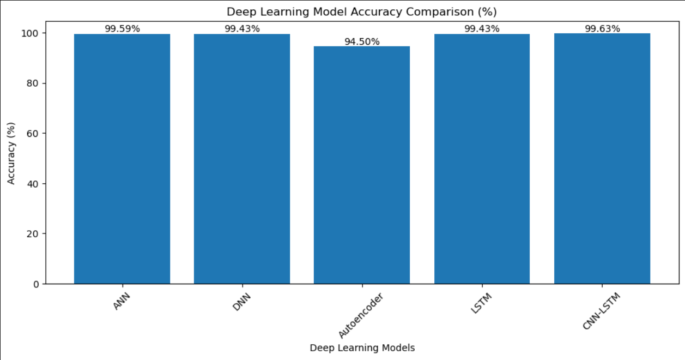
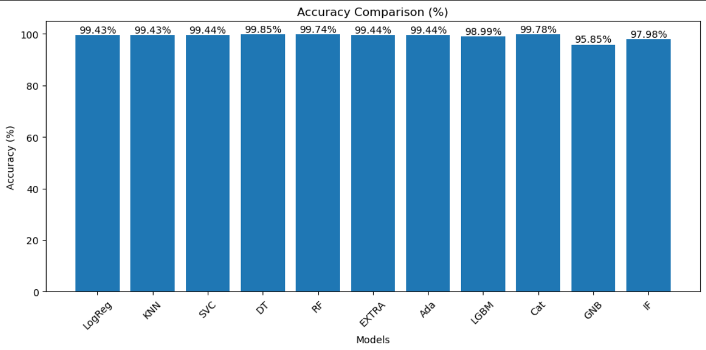
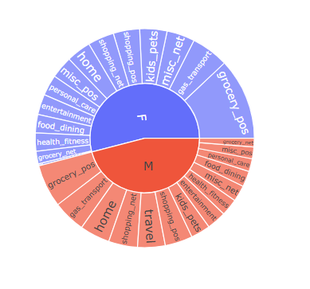
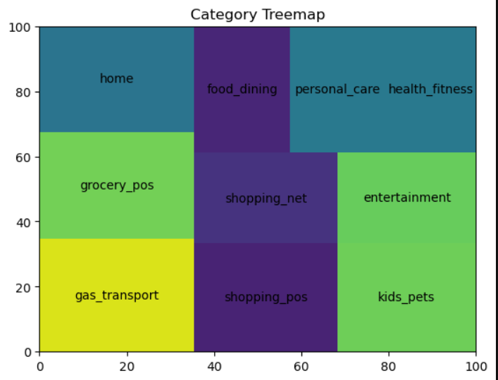

# 💳 Credit Card Fraud Detection using Machine Learning & Deep Learning

## 📖 Project Description
This project focuses on detecting fraudulent credit card transactions using advanced Machine Learning and Deep Learning techniques on highly imbalanced financial datasets. The project includes complete data preprocessing, feature engineering, anomaly detection, model training, evaluation, visualization, and prediction generation on unseen datasets. Multiple ML and DL algorithms were implemented and compared to identify the most accurate and reliable fraud detection model.

---

# 🎯 Objectives
- Detect fraudulent credit card transactions accurately
- Compare Machine Learning and Deep Learning models
- Handle highly imbalanced financial datasets
- Implement anomaly detection techniques
- Generate predictions on unseen transaction data
- Improve financial security using AI-based solutions

---

# ⚙️ Technologies Used
- Python
- Pandas
- NumPy
- Scikit-Learn
- TensorFlow / Keras
- Matplotlib

---

# 📂 Project Workflow

## 🔹 Data Preprocessing
- Handling missing values
- Label Encoding
- Feature Scaling
- Train-Test Split
- Data Transformation

## 🔹 Feature Engineering
- Feature Selection
- Feature Preparation
- Data Reshaping for Deep Learning Models

## 🔹 Model Training
Both Machine Learning and Deep Learning models were trained and evaluated using classification metrics and accuracy comparison techniques.

---

# 🤖 Machine Learning Algorithms Used

## 🔹 Basic Classification Models
- Logistic Regression
- K-Nearest Neighbors (KNN)
- Support Vector Machine (SVM)

## 🔹 Tree & Ensemble Models
- Decision Tree Classifier
- Random Forest Classifier
- AdaBoost Classifier
- LightGBM Classifier
- CatBoost Classifier
- Extra Trees Classifier

## 🔹 Anomaly Detection Models
- Isolation Forest

---

# 🧠 Deep Learning Algorithms Used

## 🔹 Neural Network Models
- Artificial Neural Network (ANN)
- Deep Neural Network (DNN)

## 🔹 Sequential Learning Models
- Long Short-Term Memory (LSTM)

## 🔹 Anomaly Detection Models
- Autoencoder

## 🔹 Hybrid Deep Learning Models
- CNN-LSTM Hybrid Model

---

# 📊 Model Evaluation
The models were evaluated using:
- Accuracy Score
- Precision
- Recall
- F1-Score
- Classification Report

Performance comparison graphs were also created for both ML and DL models.

---

# 🏆 Best Performing Model
The CNN-LSTM Hybrid Deep Learning Model achieved outstanding performance by combining convolutional feature extraction with sequential learning, making it highly effective for detecting fraudulent financial transactions.

---

# 📈 Results
- Successfully detected fraudulent transactions with very high accuracy
- Compared multiple ML and DL models
- Generated prediction datasets on unseen transaction data
- Demonstrated the practical use of AI in fraud detection systems

---

# 📌 Conclusion
This project demonstrates how Machine Learning and Deep Learning techniques can significantly improve fraud detection systems by identifying suspicious financial activities efficiently and accurately. The comparative analysis shows that hybrid deep learning architectures such as CNN-LSTM can effectively capture complex transaction patterns and enhance fraud prediction performance in real-world financial datasets.

## 📊 Visualizations






## 🚀 How to Run

Follow these steps to set up and run the project locally:

```bash
# 1. Clone the repository
git clone https://github.com/HelloApurva/Credit-Card-Fraud-Detection-Analysis-.git
cd Credit-Card-Fraud-Detection-Analysis-

# 2. Create a virtual environment (recommended)
python -m venv venv

# Activate environment
# Windows:
venv\Scripts\activate

# Mac/Linux:
source venv/bin/activate

# 3. Install dependencies
pip install -r requirements.txt

# If requirements.txt is not available, use:
pip install numpy pandas matplotlib seaborn scikit-learn jupyter

# 4. Run Jupyter Notebook
jupyter notebook

# Then open your main notebook file in the browser
